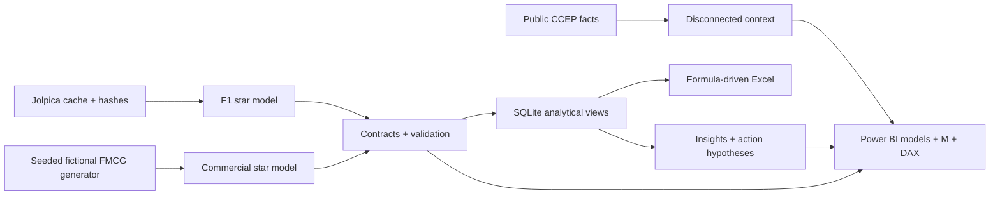
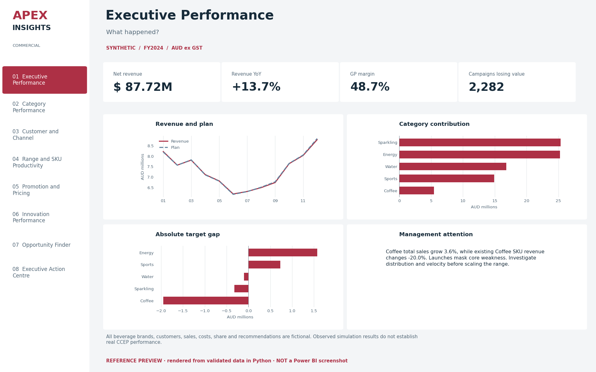
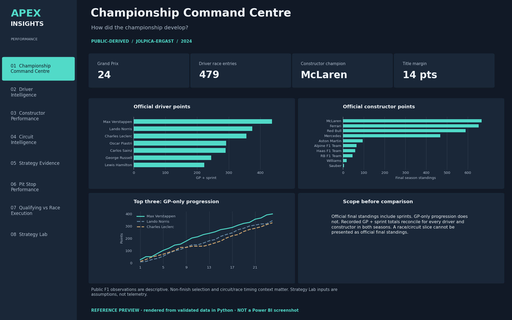
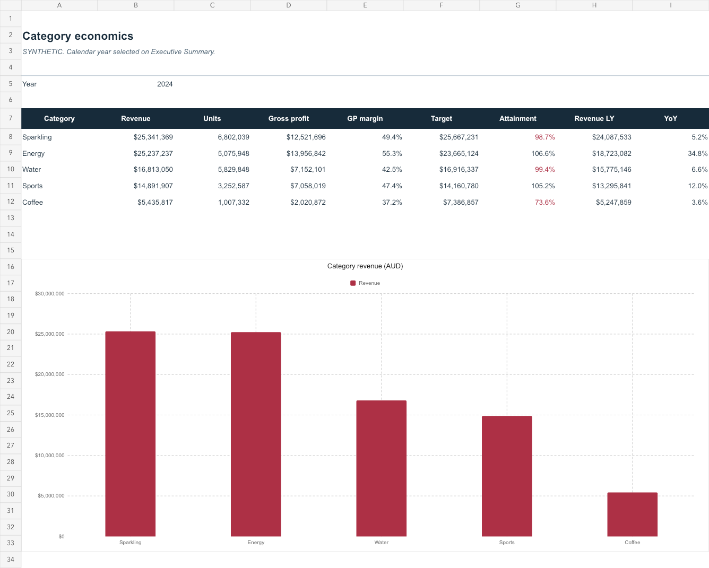

# APEX INSIGHTS

### Commercial & Performance Intelligence

A two-domain Business Intelligence portfolio: fictional FMCG category economics
and licensed public Formula 1 execution data. Designed around **question →
performance → driver → opportunity → action**, with Power BI as the principal
report format and Python, SQL and Excel providing reproducible evidence.

**Current release:** pipelines and analytical outputs implemented and tested;
native Power BI report/model source authored and structurally validated.
**Windows Power BI refresh/render/interaction acceptance remains pending.**
No deployed CCEP/F1 dashboard or realised company outcome is claimed.

## Project Overview

| Domain | Data | Analytical purpose |
|---|---|---|
| Commercial/category | 248,580 **SYNTHETIC** daily sales rows; fictional brands/accounts | Growth, mix, range productivity, distribution, promotions, launch review and action hypotheses |
| F1 performance | **PUBLIC** 2023–2024 Jolpica results, qualifying, sprints, pits and standings; two sampled lap datasets | Championship scope, driver/team execution, circuit patterns, pit consistency and explicitly simulated strategy sensitivity |

838,813 fact observations across the two models. All source files,
table grains, measures and checks can be inspected. The distinction between
public facts and generated performance is visible in rows, report footers,
Excel, documentation and the [source register](docs/sources.md).

## Why I Built This

To demonstrate commercial/category analytics and performance intelligence using
Power BI, DAX, Power Query, SQL, Python and Excel. The commercial domain is
relevant to the reasoning expected of a Category Performance & Insights Analyst:
category → brand → SKU → customer → channel → driver → test → monitor.
The F1 domain demonstrates a different discipline: separate qualifying/grid
scope, session points, race context and survivorship before drawing conclusions.
This project supports interview discussion; it does not imply employment,
affiliation or access to confidential Coca-Cola/CCEP information.

## Business Questions

- Is growth driven by volume, realised price/mix or launches?
- Does category growth hide declining existing-range performance?
- Where is a distribution gap attractive after velocity dilution and added cost?
- Which promotions lift packs but reduce contribution?
- Which launches combine repeat, velocity, margin and target attainment?
- Which drivers/constructors improve relative to grid, and how does non-finish
  selection alter that reading?
- How do sprint inclusion and pit-duration scope affect F1 conclusions?

Full decision map: [business questions](docs/business_questions.md).

## Architecture



Detailed [architecture](docs/architecture.md), [methodology](docs/methodology.md)
and [data dictionary](docs/data_dictionary.md).

## Data Sources

**REAL PUBLIC DATA:** [CCEP's FY2024 public results](https://www.cocacolaep.com/news-and-stories/q4-and-fy-financial-results/)
provide three small attributed Group growth facts; they are not Australian
SKU/customer economics. Direct report download returned 403, so no restricted
scraping was performed. [Jolpica-F1](https://github.com/jolpica/jolpica-f1)
supplies the F1 snapshot via its documented API with cache, pagination,
custom User-Agent and conservative rate limiting.

The current public snapshot labels lapped finishers `Lapped`. Completion logic
accepts that status and legacy `+N Lap(s)`; it does not count lapped finishers
as retirements.

**SYNTHETIC DATA:** every commercial product/customer transaction, cost, target,
promotion, market denominator, distribution and cohort observation is generated.
All beverage brands and accounts are fictional. Synthetic share is share of
a generated market, never factual CCEP share. No public growth fact calibrates
the simulated operational model. [Source rights and attribution](docs/sources.md).

Code/original synthetic work is MIT. F1 data and adaptations are
**CC BY-NC-SA 4.0** under [Jolpica terms](https://github.com/jolpica/jolpica-f1/blob/main/TERMS.md),
with [data attribution](data/LICENSE-F1.md). Third-party data is not relicensed as MIT.
Bundled Microsoft schemas retain their original notice; see
[third-party notices](THIRD_PARTY_NOTICES.md).

## Data Model

Commercial facts preserve daily SKU/account grain. Market has
date/category/channel/region grain; share goes blank for incompatible SKU/account
filters. Separate targets/distribution/promotion facts prevent fanout. Brands
and pack sizes live in Product; channel and region are conformed dimensions.

F1 facts use race/driver/team grain and actual race constructor assignments.
Final standings have season grain and filter guards. No invented tyre/telemetry
table, fact-to-fact or bidirectional relationship. [Model documentation](powerbi/model_documentation.md).

## Power BI

Native projects: [Commercial.pbip](powerbi/Commercial.pbip) and
[Motorsport.pbip](powerbi/Motorsport.pbip), with eight analytical pages each,
plus tooltip/drillthrough utility pages. They contain actual PBIR visual/query
bindings, semantic model partitions, **78 DAX measure definitions**,
reusable M functions, field/What-If parameters, sync groups, navigation and an
executive bookmark. Source authored; runtime behavior is not yet certified.

Commercial pages: Executive, Category, Customer/Channel, Range, Promotion,
Innovation, Opportunity Finder and Action Centre. F1 pages: Championship,
Driver, Constructor, Circuit, Strategy Evidence, Pit Stops, Qualifying-to-Race
and Strategy Lab. The strategy evidence page transparently substitutes
observed pit windows for unavailable tyre-compound telemetry.

Read the [setup guide](powerbi/README.md), [page specification](powerbi/dashboard_spec.md),
[DAX library](powerbi/dax_measures.md), [M transformations](powerbi/power_query.md)
and [pending native acceptance checklist](powerbi/runtime_acceptance.md).

## Key Insights

**SYNTHETIC commercial findings, FY2024:**

- Revenue AUD **87.72M**, up **13.7%**; GP margin **48.7%** before trade spend/overheads.
- Coffee grows **3.6%** overall, but existing Coffee SKUs decline **20.0%**. Launch revenue masks core-range weakness.
- **2,282 of 2,321** FY2024 campaign-year records lift units but reduce net incremental profit. The no-promotion baseline is a generator counterfactual.

**PUBLIC_DERIVED F1 findings:** McLaren leads the
official 2024 constructor standings by **14 points**.
Among drivers with at least ten eligible 2024 starts, Lewis Hamilton
has the highest average classified position gain (**+2.50**,
**n=22**). Nonfinishers/pit-lane starts are excluded from
movement, so this does not establish causal driver superiority.

All findings are computed by `python/analyse.py`, with SQL extracts and
[evidence-backed actions](docs/insights.md).

## Recommendations

Investigate existing-range Coffee demand/distribution before expanding the
launch. Test shallower discounts with matched controls and measure incremental
profit after execution costs. Trial selected high-margin distribution gaps,
using velocity retention and contribution after listing/logistics costs as
gates. These are hypotheses derived from synthetic analysis, with no realised
savings or real CCEP range recommendation claimed.

For F1, separate GP/sprint points, show movement sample/non-finishes and compare
pit duration within a race. The simulator explores assumptions; it does not
predict race outcomes or advise teams with unavailable telemetry.

## Technology

Power BI PBIP/PBIR + TMSL, DAX, Power Query M, Python pandas/NumPy/requests,
SQLite SQL, pytest/JSON Schema and a native `.xlsx` Excel pack with SUMIFS,
XLOOKUP, charts, conditional formatting and live scenario calculations.
PivotTables were not created; formula summaries give portable auditable behavior.

## Screenshots

The workbook previews are real rendered workbook outputs. The 16 data-derived
report reference layouts are Python renders, **not Power BI screenshots**.
Actual Power BI screenshots remain pending Windows runtime acceptance.
Open [the reference gallery](assets/preview.html) locally to browse every page.







## Reproducibility

Python 3.9–3.12. From this directory:

```bash
python -m venv .venv
# Windows: .venv\Scripts\activate
source .venv/bin/activate
pip install -r requirements.txt
python python/run_all.py
pytest -q tests
```

Default replay uses the included hashed public cache and needs no API network
access. `python python/run_all.py --refresh-public` fetches missing cache pages
under current source terms/rate limits; delete a chosen cache entry and manifest
entry only if intentionally replacing it. Existing cached pages are immutable.
`--refresh-public` permits API access, not automatic overwrite of the historical
snapshot. Pipeline saves manifests, validation, analytical extracts, insights
and report source, then renders the labelled reference gallery. It does not run
Power BI Desktop.
`python python/verify_reproducibility.py` replays offline and compares all
38 supplied processed CSVs byte-for-byte; its evidence is saved in
`outputs/reproducibility_report.json`.

Excel rebuild uses `node excel/build_management_pack.mjs` with the
`@oai/artifact-tool` dependency in a compatible authoring environment; the
exported workbook is supplied for ordinary Excel use. Python replay does not
require that proprietary authoring library. [Excel guide](excel/README.md).

## Validation

**334 data checks pass**, including keys/nulls/FKs, dates, sales/cost/GP
identities, store-day bounds, market components, cohorts, promotion profit,
championship points and raw hashes. **409 native
project/report files** pass Microsoft's JSON schemas; **332
field references** are checked. Adversarial tests inject duplicate keys, bad
math, wrong provenance and invalid dates. See [validation report](docs/validation_report.md).

Excel controls reconcile to Python; changing year and scenario inputs is tested
in the authoring engine. Source validation cannot certify DAX/M execution,
native report visual roles, interaction behavior or performance. The
[quality gate](docs/quality_gate.md) explicitly retains that gap.
Run `python python/audit_repository.py` to check the supplied export, links,
file sizes and processed hashes. See [repository audit](docs/repository_audit.md).

## Limitations

No internal CCEP data, genuine retailer market share, causal real-world promotion
effect, F1 compounds/weather/telemetry, enterprise-scale benchmark or realised
business outcome. Synthetic competitor dollars and category changes reflect
generator assumptions. One missing pit duration is retained. Sample raw lap
timings contain race confounders. Native Power BI runtime remains untested.
Detailed limitations: [methodology](docs/methodology.md).

## Future Improvements

Recruiter materials: [case study](docs/portfolio_case_study.md),
[interview guide](docs/interview_guide.md), [defensible resume bullets](docs/resume_bullets.md).
