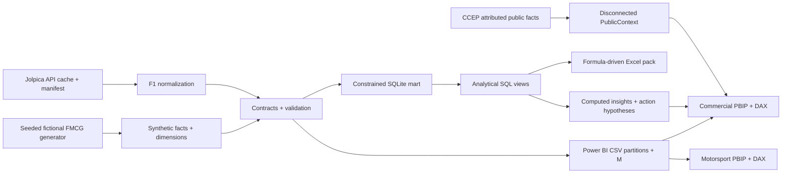

# Architecture

Two semantic models isolate domains and rights. Power BI is the principal
delivery format. Python performs source ingestion, seeded generation and
cross-table quality checks; M independently checks types, keys, provenance
and the product/category mapping before import. SQL enriches/aggregates each
fact independently, joining aggregates only at matching grain.

Daily FMCG fact keys are Date/Product/Customer. Date, Product, Category,
Customer, Channel and Region filter facts directly in one direction.
Category/channel/region keys are denormalized onto facts and tested against
product/customer attributes. This keeps the market denominator at its valid
category/channel/region grain without a many-to-many relationship.

F1 uses Race/Driver/Constructor facts. Season, Circuit and Date filter DimRace
then session facts. Final standings use Season with Driver or Constructor,
and intentionally do not react to race/circuit filters. There is no fact-to-fact
relationship, bidirectional filter, commercial/F1 union or invented tyre table.

Native PBIR pages and TMSL model.bim are version-control friendly. Windows
Power BI Desktop remains necessary for refresh, DAX runtime, interactions,
performance recording and actual Power BI screenshots. CSV/SQL evidence and
the Excel pack can be reviewed independently.
