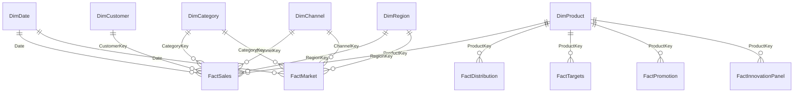
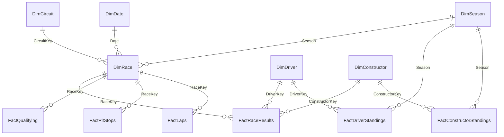

# Semantic models

The two `model.bim` files include actual partitions, typed columns, relationships,
measure definitions, date marking metadata, lineage tags and disconnected
parameter tables. All keys are hidden; descriptive fields remain visible.
Import mode, en-AU query culture, compatibility level 1601. CSV partition paths
are relative to the single `DataRoot` M parameter.

## Commercial

Six conformed dimensions filter sales, distribution, targets, promotion and
innovation panel facts directly. Market has Date/Category/Channel/Region only.
Product carries Brand/PackMl/Innovation/LaunchDate rather than extra one-to-one
dimensions. Customer carries descriptive channel/region attributes but those
are not relationship chains; fact keys provide the conformed filters. Validators
enforce product/category and account/channel/region consistency.

`PublicContext` and the FY2024 `ActionCentre` snapshot are disconnected and
labelled. Action Centre has no ordinary analytical slicers; the snapshot scope
is displayed. `KPISelector`, `AnalysisAxis` field parameter and `DistributionGoal`
are disconnected. No target duplication through sales/promotion joins.

Diagram abbreviates repeated six-dimension relationships; `contracts.py` and
the model files are the complete relationship register.

## F1

Race/Driver/Constructor filter results, qualifying, sprint, pits and sample laps.
Date/Season/Circuit filter Race. Standings use Season+Driver or Season+Constructor
with explicit DAX guards for incompatible filters. No constructor attribute
on a career driver dimension: actual race team is retained in each fact.

No bidirectional or many-to-many relationship. No fabricated tyre/telemetry
dimension. Strategy parameters are independent assumptions, not fitted data.
